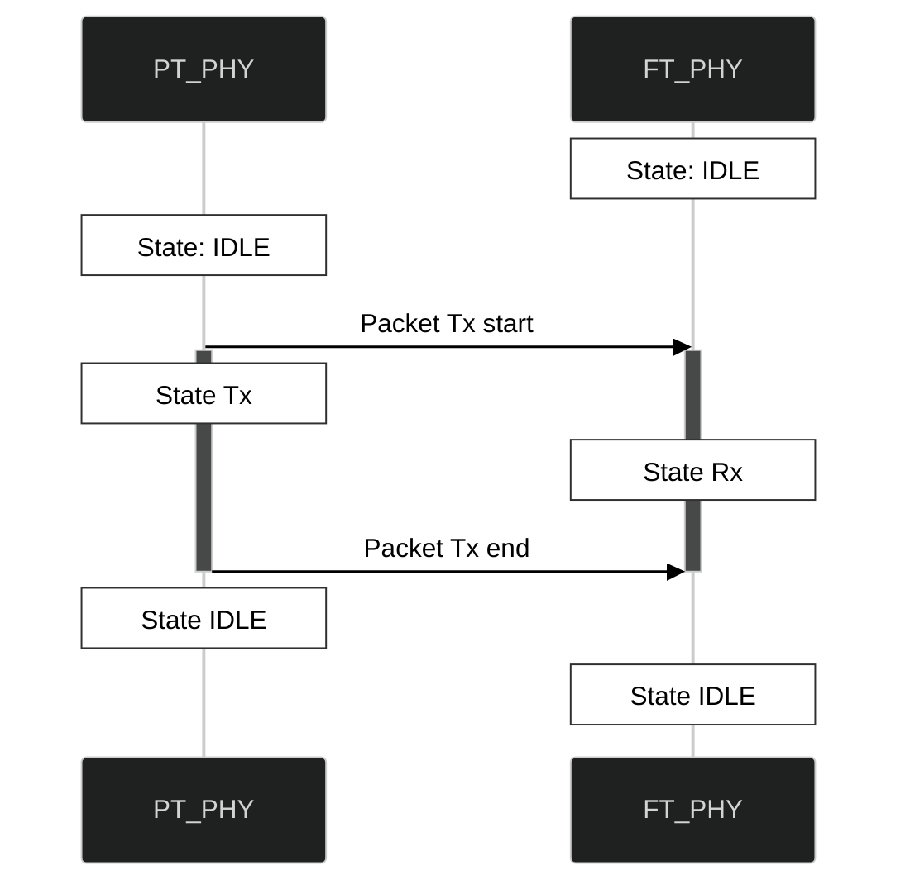
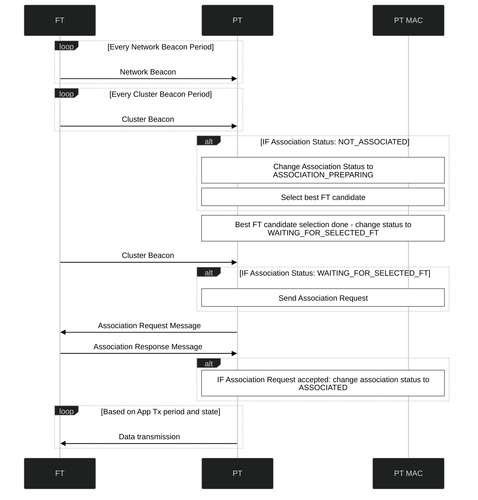
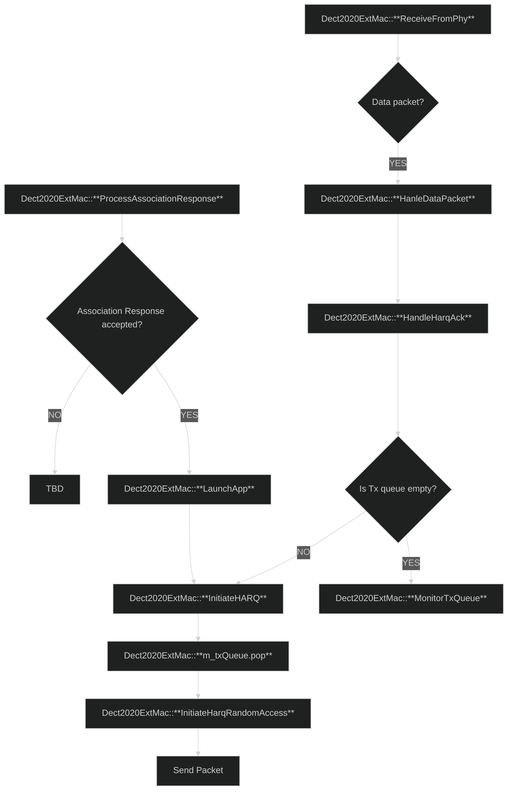
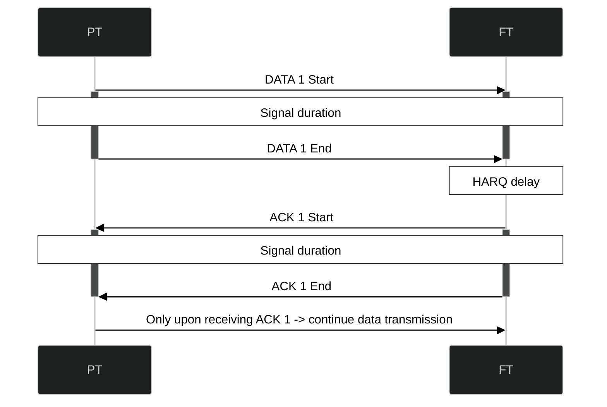

# PHY Rx State Machine

```mermaid
---
config:
  theme: dark
  look: classic
  sequence:
    actorMargin: 150
  themeVariables:
    primaryTextColor: "#ffffff"
    noteBkgColor: "#ffffff"
    noteTextColor: "#000000"
    signalColor: "#000000"
    signalTextColor: "#000000"
    loopTextColor: "#000000"
---
sequenceDiagram

participant PT_PHY
participant FT_PHY

Note over FT_PHY: State: IDLE
Note over PT_PHY: State: IDLE
PT_PHY ->> FT_PHY: Packet Tx start
activate PT_PHY
activate FT_PHY
Note over PT_PHY: State Tx
Note over FT_PHY: State Rx
PT_PHY ->> FT_PHY: Packet Tx end
deactivate PT_PHY
deactivate FT_PHY
Note over PT_PHY: State IDLE
Note over FT_PHY: State IDLE
```

# Association Procedure

```mermaid
---
config:
  theme: dark
  look: classic
  sequence:
    actorMargin: 150
  themeVariables:
    primaryTextColor: "#ffffff"
    noteBkgColor: "#ffffff"
    noteTextColor: "#000000"
    signalColor: "#000000"
    signalTextColor: "#000000"
    loopTextColor: "#000000"
---
sequenceDiagram
participant FT
participant PT
participant PT_MAC as PT MAC

loop Every Network Beacon Period
  FT ->> PT: Network Beacon
end

loop Every Cluster Beacon Period
  FT ->> PT: Cluster Beacon
end

alt IF Association Status: NOT_ASSOCIATED
  Note over PT, PT_MAC: Change Association Status to <br> ASSOCIATION_PREPARING
  Note over PT, PT_MAC: Select best FT candidate
end

Note over PT, PT_MAC: Best FT candidate selection done - change status to <br> WAITING_FOR_SELECTED_FT

FT ->> PT: Cluster Beacon

alt IF Association Status: WAITING_FOR_SELECTED_FT
  Note over PT, PT_MAC: Send Association Request 
end

PT ->> FT: Association Request Message
FT ->> PT: Association Response Message

alt
  Note over PT, PT_MAC: IF Association Request accepted: change association status to <br> ASSOCIATED
end

loop Based on App Tx period and state
 PT ->> FT: Data transmission
end
```

```mermaid
---
config:
  theme: dark
  look: classic
---
flowchart TD
ProcessAssociationResponse[Dect2020ExtMac::**ProcessAssociationResponse**]
AssociationResponseAccepted{Association Response accepted?}
LaunchApp[Dect2020ExtMac::**LaunchApp**]
InitiateHARQ[Dect2020ExtMac::**InitiateHARQ**]
DequeuePacket[Dect2020ExtMac::**m_txQueue.pop**]
InitiateHarqRandomAccess[Dect2020ExtMac::**InitiateHarqRandomAccess**]
SendPacket[Send Packet]
ReceiveFromPhy[Dect2020ExtMac::**ReceiveFromPhy**]
IsDataPacket{Data packet?}
HandleDataPacket[Dect2020ExtMac::**HanleDataPacket**]
HandleHarqAck[Dect2020ExtMac::**HandleHarqAck**]
IsTxQueueEmpty{Is Tx queue empty?}
MonitorTxQueue[Dect2020ExtMac::**MonitorTxQueue**]

ProcessAssociationResponse --> AssociationResponseAccepted
AssociationResponseAccepted -- YES --> LaunchApp
AssociationResponseAccepted -- NO --> TBD1[TBD]
LaunchApp --> InitiateHARQ
InitiateHARQ --> DequeuePacket
DequeuePacket --> InitiateHarqRandomAccess
InitiateHarqRandomAccess --> SendPacket

ReceiveFromPhy --> IsDataPacket
IsDataPacket -- YES --> HandleDataPacket
HandleDataPacket --> HandleHarqAck
HandleHarqAck --> IsTxQueueEmpty
IsTxQueueEmpty -- YES --> MonitorTxQueue
IsTxQueueEmpty -- NO --> InitiateHARQ
```

## 6.1 Stop-and-Wait ARQ

```mermaid
---
config:
  theme: dark
  look: classic
  sequence:
    actorMargin: 150
  themeVariables:
    primaryTextColor: "#ffffff"
    noteBkgColor: "#ffffff"
    noteTextColor: "#000000"
    signalColor: "#000000"
    signalTextColor: "#000000"
    loopTextColor: "#000000"
---
sequenceDiagram

participant PT
participant FT

PT ->> FT: DATA 1 Start
activate PT
activate FT
Note over PT, FT: Signal duration
PT ->> FT: DATA 1 End
deactivate PT
deactivate FT
Note over FT: HARQ delay
FT ->> PT: ACK 1 Start
activate PT
activate FT
Note over PT, FT: Signal duration
FT ->> PT: ACK 1 End
deactivate PT
deactivate FT
PT ->> FT: Only upon receiving ACK 1 -> continue data transmission
```